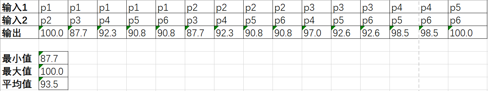

# codesim

本项目基于[ANTLR](https://www.antlr.org/)框架、模仿CCFinder[1]方法实现了一个c++代码相似度度量的工具codesim。

## 编译

本项目使用Maven构建。在根目录中执行

```shell
mvn package
chmod +x codesim
```

后即可使用。编译完成后`code/target/codesim-1.0-SNAPSHOT-jar-with-dependencies.jar`文件即为本工具的核心模块。

在根目录中执行

```shell
./codesim
```

即可看到使用说明

> usage: codesim [-v|--verbose] [-h|--help] code1 code2

根据使用说明，可以在传入文件名的同时指定不同的选项，例如

```shell
./codesim -v 1.cpp 2.cpp
```

## 流程

codesim的主要步骤如下：

1. 从主类`CodeSim`类开始，首先接收并处理用户输入、读取代码文件，然后将字符串形式的代码交由`CppCompare`类处理；

2. `CppCompare`类中，首先使用ANTLR工具将源代码分词（即`tokenize`方法），然后对token进行过滤（即`filter`方法）。在`filter`方法中，我们实现了[1]中介绍的RC1、RC2和RC5三种转换规则。

3. 之后，我们用一个大小为$tokenNumOfFile1\times tokenNumOfFile2$的布尔矩阵表示文件1中每个token与文件2中每个token的类型（如`'int'`、`Identifier`）是否相等。基于该矩阵，我们求得所有长度大于10的连续相同token串，即所有满足

   ```python
   tokens1[i:i+length]==tokens2[j:j+length] and length>=10
   ```

   的`(i,j,length)`。对于有包含关系的token串，我们只保留更长的那一对。

4. 最后，分别计算两个文件的`COVERAGE`。例如，若存在满足上述条件的`(i,j,length)`，则`tokens1[i:i+length]`中的所有token都会被标记为`covered`，而被标记为`covered`的token数的占比即为文件1的`COVERAGE`。

5. 求得两个文件各自的`COVERAGE`后，我们将较大的那一个作为最终结果。

## 效果评估

我们对codesim的效果进行了评估。

### 数据集

- 对于阳性数据，我们使用了从[该链接](https://tautcony.xyz/2018/01/06/moss-and-sim/)下载的6份C语言代码，这些代码两两之间均可以视为互相抄袭。
  - 记为`p1`、`p2`，...，`p6`
- 对于阴性数据，考虑到codesim主要面向Online Judge上的编程作业，我们从LeetCode中随机选取了5个问题，并分别在这些问题的讨论区中随机选取2份使用C++语言实现的代码。同一问题的不同实现可以视为具有类似功能、但没有互相抄袭的代码。
  - 问题1：[n1-1](https://leetcode.com/problems/largest-triangle-area/discuss/122711)、[n1-2](https://leetcode.com/problems/largest-triangle-area/discuss/863701)
  - 问题2：[n2-1](https://leetcode.com/problems/binary-tree-postorder-traversal/discuss/45550)、[n2-2](https://leetcode.com/problems/binary-tree-postorder-traversal/discuss/774726)
  - 问题3：[n3-1](https://leetcode.com/problems/minimum-falling-path-sum-ii/discuss/452207)、[n3-2](https://leetcode.com/problems/minimum-falling-path-sum-ii/discuss/723719)
  - 问题4：[n4-1](https://leetcode.com/problems/task-scheduler/discuss/104504)、[n4-2](https://leetcode.com/problems/task-scheduler/discuss/104493)
  - 问题5：[n5-1](https://leetcode.com/problems/random-point-in-non-overlapping-rectangles/discuss/170503)、[n5-2](https://leetcode.com/problems/random-point-in-non-overlapping-rectangles/discuss/154795)

### 结果

#### 阳性数据集结果



#### 阴性数据集结果


### 讨论

codesim在阳性数据集上平均为93.5，最坏情况下（即最小）为87.7。在阴性数据集上平均为29.8，比阳性低63.7；最坏情况下（即最大）为50.6，比阳性数据集的最坏情况（即最小）低37.1。从实验结果可以看到，codesim能够较好地分辨代码抄袭与否。

## 说明

- `src.main.resources`文件夹中的两个`.g4`文件来源于[ANTLR4官方语法库](https://github.com/antlr/grammars-v4/tree/master/cpp)；源代码中`antlr`包的所有文件由[ANTLR](https://www.antlr.org/)框架自动生成。

## 参考资料

1. Kamiya T, Kusumoto S, Inoue K. CCFinder: a multilinguistic token-based code clone detection system for large scale source code[J]. IEEE Transactions on Software Engineering, 2002, 28(7): 654-670.
2. https://wizardforcel.gitbooks.io/antlr4-short-course/content/rewriting-input-stream.html
3. https://pdfs.semanticscholar.org/98e8/10ed098a651e0ba8cbb63d2d926d4eebdf9b.pdf
4. https://github.com/antlr/antlr4

